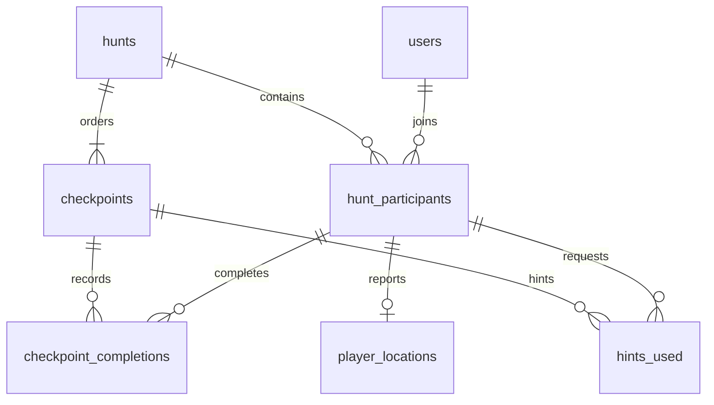

# Interview guide — actual September 2026 implementation

Prepared for 26 September 2026 (Asia/Kolkata). These are practice questions based on this code and the supplied Digital Engineering JD, not private Tredence interview questions. Do not claim live OpenAI success or a production deployment unless you later verify them.

## A natural 60-second explanation

“I built a multiplayer scavenger hunt around MNNIT. Players log in, join the same hunt, solve a clue and verify a location to unlock the next one. React shows the clue, Leaflet map and leaderboard. Express exposes REST endpoints, and PostgreSQL stores the real game state. The important rule is that the server owns progress and score. A transaction locks the participant while validating and completing a checkpoint, so two clicks cannot reward it twice. I use polling for near-real-time updates because it is enough for an interview demo and simple to debug. The app also works without GPS or internet tiles through a clearly labeled demo location mode and a bundled map. OpenAI can draft clues for an organizer, but prepared clues keep the game playable when the API is unavailable. This is a recent rebuild of my earlier prototype, and I tested it with real PostgreSQL and two browser sessions.”

## Five-minute click-by-click rehearsal

| Time | Action | Explain |
|---|---|---|
| 0:00–0:40 | Run `npm run demo`; open two independent tabs at http://127.0.0.1:3001. Log in as demo@mnnit.com and player2@mnnit.com, password demo123. | No OAuth or paid API is needed. Separate tab session storage keeps users distinct. |
| 0:40–1:10 | Start/resume the hunt in both; set team names before joining if desired. | Joining is idempotent and state lives in PostgreSQL. |
| 1:10–1:40 | Read the prepared clue and show offline map. Enable Demo Location Mode. | The clue response does not contain the next answer/coordinate; demo controls intentionally reveal it. |
| 1:40–2:15 | Simulate arrival → Check location. Show new clue, score and trail. | Simulation saves a location; the same completion transaction still checks distance/order. |
| 2:15–2:45 | Look at the other tab's leaderboard; complete that player's checkpoint. | These are two real authenticated players, not the labeled simulated opponents. Polling catches up in about 2.5 seconds. |
| 2:45–3:15 | Refresh the first tab; re-enable demo switch. Use a hint. | The run survives refresh; hint cost is exactly once. |
| 3:15–4:15 | Arrival/check through remaining checkpoints. | Base reward plus server-timed bonus; final checkpoint adds 200. |
| 4:15–4:40 | Show completion summary and second tab's updated board. | Rank is current; completion time is persisted. |
| 4:40–5:00 | Reset my run → Confirm reset. Optionally draft a clue. | Reset is user-scoped; no-key clue draft is labeled Prepared clue. |

If time is short, complete only two checkpoints and explain that the final completion path is already tested. Do not pretend a partially shown live run is a newly demonstrated full run.

## Follow one request through the code

1. `client/src/pages/GamePage.jsx`: reads the current clue from `useHunt`. **Simulate arrival** sends `POST /api/demo/arrival` with hunt ID.
2. `client/src/services/api.js`: adds the tab's JWT to the Authorization header, JSON-encodes the body and normalizes errors.
3. `server/auth.js`: verifies JWT signature, algorithm, issuer and expiry; loads the user and rejects unavailable/demo accounts in public mode.
4. `server/routes.js`: binds the route to the authenticated user. Arrival saves the current server-owned destination as a demo position.
5. **Check location** calls `/check-location`, then `/complete-checkpoint` with the checkpoint ID. The second call repeats validation; it never trusts the first response.
6. `server/services/game.js`, `check()`: begins a transaction; `SELECT ... FOR UPDATE` locks this participant; checks an existing completion; requires the current checkpoint; loads recent location; applies `distance()`; calculates points using database time; inserts completion; advances score/index and final timestamp; commits.
7. `server/database/schema.sql`: unique completion primary key and unique participant/hunt pair reinforce idempotency.
8. `useHunt.js`: refreshes progress after the mutation; every 2.5 seconds it polls progress, leaderboard and player positions. The second user learns about the update from the next poll.
9. `Leaderboard.jsx`: renders server-ranked rows and highlights the logged-in user. `GameMap.jsx` renders recent player positions and discovered locations.

REST routes are listed in README. A useful debugging breakpoint is the start of `check()`, followed by the `UPDATE hunt_participants` statement. Never log Authorization headers or the database URL while debugging.

## Data model

No separate team-members table is implemented: `team_name` is the participant's display name, not a multi-account shared-score team. Users have independent runs. Participant `current_checkpoint` is the next sequence number, so finished means 7 for the six-point hunt. `completed_at` distinguishes finished/active. The initial seed is a single six-checkpoint hunt; supporting arbitrary hunt lengths requires replacing the explicit six-point assumptions.

## Location math and trust

Convert latitude/longitude differences to radians. With `a = sin²(Δlat/2) + cos(lat1)cos(lat2)sin²(Δlon/2)`, distance is `2R atan2(√a, √(1−a))`, with `R = 6,371,000m`. It is sufficient for an 80-meter campus game radius, not surveying. GPS can drift, permission can be denied and users can forge client coordinates. HTTPS protects transport, not the truth of a reported coordinate. For real prize-bearing events, add checkpoint QR/NFC challenges, staff validation or stronger signed evidence and risk checks.

## Design choices, tradeoffs and scaling

- PostgreSQL gives durable state, foreign keys, uniqueness and row locks without inventing a distributed system.
- Leaflet provides geographic map interaction and local image overlays; no Google Maps account is required.
- Polling is simple and tunnel-compatible. Three reads per cycle means about 1.2 requests/second/player, or about 1,200/second at 1,000 players: aggregate endpoints, cache leaderboard reads, tune cadence and pool capacity before scaling.
- Row locks serialize one player's mutations while different players usually proceed independently. Add retries for deadlocks/serialization failures if more complex transactions are introduced.
- JWT in sessionStorage makes two-tab demos easy but is readable by injected JavaScript. Production should evaluate secure HttpOnly cookies with CSRF defenses or short-lived access tokens/refresh rotation. Current JWTs expire after eight hours; no revocation table is implemented.
- Rate limits are process-local. Distributed hosting needs a shared limiter or gateway. Do not enable Express `trust proxy` broadly; configure known hops accurately.
- Clue generation is optional, organizer-only, bounded by a timeout and never in the critical join/progress path. AI drafts need human review before publication; this version does not auto-publish them.
- The offline map is an original illustration with illustrative coordinates. It cannot prove the exact position of a real campus building.

## 30 project questions with concise answers

1. **What is the source of truth?** PostgreSQL. React renders API responses; it does not invent the player's score or checkpoint.
2. **Why React?** Components and hooks make clue, map, auth and leaderboard state straightforward to compose.
3. **What is state versus a prop?** State is owned by a component/hook; props pass values and callbacks to children.
4. **Why an auth context?** Layout and protected pages need the same authenticated user without prop chains.
5. **Why React Router?** It maps login, register, dashboard, hunt and leaderboard URLs to views and guards protected screens.
6. **What does useEffect cleanup do here?** It clears polling timers, aborts pending requests and removes GPS watchers to prevent work after unmount.
7. **Why Fetch?** Browser-native HTTP support is enough; one wrapper handles JSON, bearer tokens and friendly errors.
8. **What makes these REST APIs?** Resources have URLs and HTTP methods convey reads, creation and partial updates; state travels as JSON.
9. **Why PATCH for location?** It updates a participant's latest position rather than replacing the whole participant resource.
10. **Why authenticate on the server?** Hiding a button is not authorization. Anyone can make an HTTP request directly.
11. **How is a password stored?** As a bcrypt hash with a salt and cost 12, never as plaintext.
12. **Is a JWT encrypted?** No. It is signed, with a subject, issuer and expiry. Do not put secrets in its readable payload.
13. **How do you stop one user modifying another?** Services derive the user ID from verified JWT middleware and query the participant by that ID and hunt.
14. **How is SQL injection prevented?** User inputs are passed as pg parameters (`$1`, `$2`); they are not concatenated into SQL syntax.
15. **Why validate if SQL is parameterized?** Parameterization prevents injection; validation enforces sensible types, ranges and business rules.
16. **What is a transaction?** A set of database changes that commits together or rolls back together.
17. **What prevents double scoring?** Participant row locking plus checking existing completion, then a composite unique completion key.
18. **Is every POST idempotent?** No. Specific operations such as join, hint and checkpoint completion are made retry-safe with stored uniqueness/rules.
19. **Why recheck location at completion?** A earlier check may be stale. The mutation independently validates current state inside the transaction.
20. **How is the speed bonus calculated?** Up to 50 points, reduced by one per six elapsed seconds since join or previous checkpoint; PostgreSQL time is authoritative.
21. **Can a hint make score negative?** Yes. It deducts exactly 20 even before the first reward, and only once per checkpoint.
22. **How does the timer survive refresh?** The API returns stored start/completion timestamps. The browser formats elapsed time rather than persisting its own counter.
23. **Is polling truly real-time?** It is near-real-time. Updates usually appear in the next 2.5-second cycle plus request latency.
24. **What happens without internet?** With installed dependencies and local PostgreSQL, prepared clues and the bundled map keep the demo working.
25. **What happens when GPS is denied?** The UI explains it and enables the explicit demo option locally; it does not crash.
26. **Can GPS be trusted?** It is client-supplied and spoofable. Haversine checks distance but cannot prove physical presence.
27. **Why a stored fallback clue?** It makes the core game deterministic and independent of provider cost, keys, rate limits and network failures.
28. **What did you test?** Real auth, SQL persistence, two players, wrong-user fields, order, concurrent duplicate requests, scoring, reset, Haversine and provider failures, plus the real browser lifecycle.
29. **What is not production-ready yet?** Surveyed campus data, anti-cheat, password recovery/email verification, distributed rate limits, session revocation, observability and a hosted production environment.
30. **What did AI assistance change?** It accelerated implementation, but I reviewed the invariants and tested the output. I can explain the code and disclose the recent rebuild honestly.

## 10 Digital Engineering / JD-grounded questions

These map to the supplied campus JD's foundations and responsibilities. They are not attributed to Tredence's private interview process.

31. **Which HTTP status would you choose?** 201 for registration, 400 for malformed inputs, 401 for unauthenticated, 403 for forbidden organizer actions, 404 for missing resources, 409 for changed checkpoint/order, 422 for valid coordinates outside the radius, 503 for unavailable database/service.
32. **What does JSON give the frontend/backend boundary?** A language-independent representation of objects, arrays and primitives; dates travel as strings and must be interpreted explicitly.
33. **How would you find each hunt's average score in SQL?** `SELECT hunt_id, AVG(score) FROM hunt_participants GROUP BY hunt_id;` Add filters to exclude simulated players by joining users.
34. **Explain an index tradeoff.** The hunt/score index can help leaderboard filtering/order, but indexes cost storage and maintenance on writes. Verify with EXPLAIN ANALYZE on realistic data.
35. **Where do data structures matter?** Arrays hold ranked rows and the six-step trail; maps/sets could deduplicate client data, but persistence and concurrency belong in SQL rather than a global JS Map.
36. **Unit versus integration versus UI tests?** Haversine is a unit test; real HTTP plus PostgreSQL is integration; clicking two sessions checks end-to-end behavior and rendering.
37. **How do you debug a failed request?** Inspect URL/status/body, reproduce it, check auth and validated parameters, inspect targeted logs and the database transaction. Avoid logging secrets.
38. **How do you collaborate with Git?** Use a focused branch, meaningful genuine commits and a PR/review where needed. Preserve history; do not fabricate dates or force-push a shared branch.
39. **How would you deploy on a cloud platform?** Build assets, run the API behind HTTPS, use managed PostgreSQL with backups and migrations, inject secrets, add health checks, logs/metrics and CI. A laptop tunnel is not production hosting.
40. **How do you review AI-generated code securely?** Read auth/authorization paths, SQL parameterization, transaction boundaries, secret handling and failure paths. Run adversarial tests, inspect UI behavior and check dependencies rather than trusting fluent output.

## Failure drill

If startup fails, first read the message and test `http://127.0.0.1:3001/api/health`. If database connectivity fails, check port 55432 and the generated `.env`; do not alter the shared service. If a stale demo server occupies 3001, `npm run stop`, then `npm run demo`. If Wi-Fi fails, stay on the offline schematic. If a tab has the wrong player, log out in that tab and sign into the second account. If a token expires, log in again; the run remains in PostgreSQL. If a clue draft falls back, explain the resilience design instead of claiming the provider worked.

Keep `docs/CHEATSHEET.md` open in VS Code. Start the app and open both sessions before the interview so the five-minute demonstration focuses on the product.
